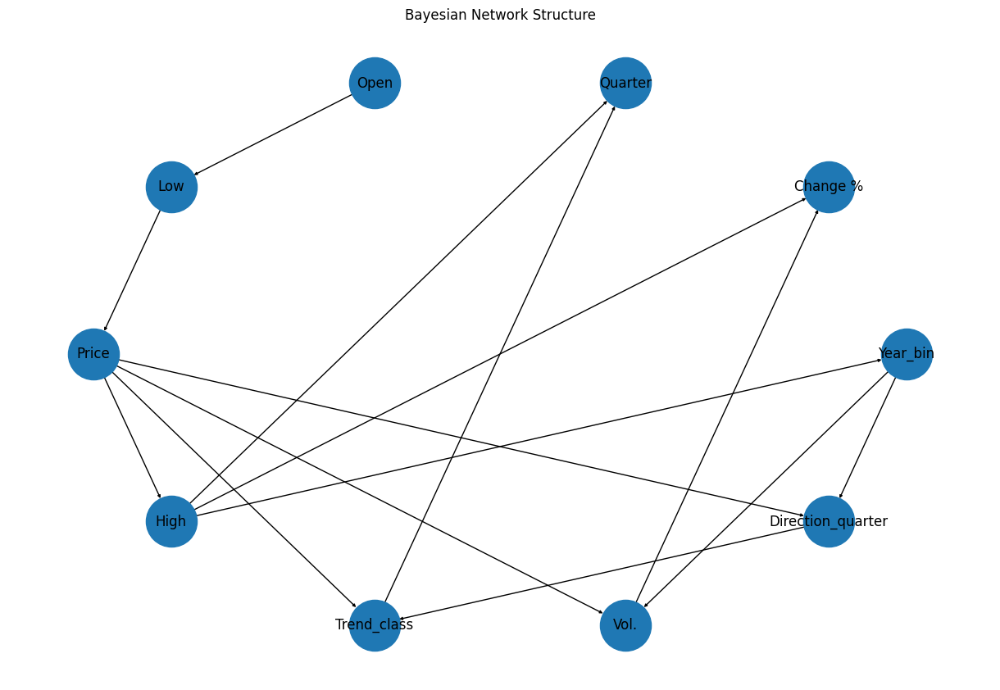

# CSE-150A-Group-Project

## Abstract
Predicting Apple stock market trends using probabilistic models can assist investors in making informed decisions, mitigating financial risks, and optimizing investment strategies. This work proposes an AI agent utilizing the PEAS framework, evaluating performance through accuracy, precision, recall, and F1-score to ensure reliability. The agent operates in financial markets, using sensors (e.g., market indicators such as opening price, high, low, volume, and percentage change) to analyze historical stock data and actuators (e.g., buy, sell, or hold recommendations) to guide investment decisions. This work explores Bayesian networks (modeling relationships between stock indicators via probability distributions), Hidden Markov Models (capturing market state transitions such as bullish and bearish trends), and hybrid approaches integrating probabilistic reasoning with machine learning. The prediction tasks focus on classifying quarterly price changes into categories (e.g., increase or decrease) and further categorizing the magnitude of change as small or large. Challenges include handling market volatility, ensuring model robustness against sudden economic shifts, and addressing ethical concerns related to algorithmic trading and investor reliance on AI predictions. By balancing predictive accuracy with financial ethics, the agent could provide a data-driven approach to stock market trend classification.

## Dataset Exploration and Preprocessing
### Preprocessing
Our dataset consists of stock price information, including 10849 observations of **open, high, low, closing prices, trading volume, and percentage changes**. Before training, we conducted an exploratory data analysis to understand the distribution of our variables. We identified several data preprocessing needs.

- The **Date** variable was converted into **datetime format** and sorted chronologically.
- String-based numerical values, such as **percentage change (Change %) and volume (Vol.)**, were converted into numeric format.
- **Missing values** were found in the **Vol. (Volume)** column. We replaced these missing values with the column mean to maintain consistency in the dataset.
- Corrupted data values were identified and corrected, ensuring all entries were valid.
- A final check using `df.isnull().sum()` confirmed that there were no missing values remaining in the dataset.
  
### Feature Engineering and Scaling
To enhance model performance, we extracted **time-based features** from the dataset and applied scaling. These transformations ensured that the model could learn patterns based on **time trends** rather than treating dates as arbitrary numerical values. 

- **Extracted Features**:
  - **Year**: Extracted from the date.
  - **Day**: Extracted from the date.
  - **Day_of_week**: Numeric representation (1-7).
  - **Quarter**: Extracted quarter of the year (1-4).

- **Binning Transformation**:
  - **Year_bin**: Years were grouped into 5 quantile-based bins to account for temporal patterns such that each bin contains 9 years.
  - **Day_bin**: Days were also categorized into 3 bins such that each bin contains roughly 10 days (early, mid, and late), using quantile-based discretization.

To prepare the dataset for Bayesian Network modeling, numerical variables **Price, Open, High, Low, VOl., Change %** were categorized where necessary

### Target Variables
Our model predicts **quarterly stock price movement**, focusing on two target variables:

- **Direction_quarter**: A binary classification task where 1 indicates a price increase and 0 indicates a decrease.
- **Trend_class**: A multi-class classification problem that categorizes the magnitude of price changes over a quarter (large decrease, moderate decrease, small decrease, small increase(including no change), moderate increase, and large increase).

To align with these targets, we introduced:
- **Price_future_quarter**: The closing price shifted 63 days ahead (approximately one quarter).
- **Quarterly_change_pct**: The percentage change in price over the next quarter.

### Column Descriptions

| Column Name          | Description |
|----------------------|-------------|
| **Date**             | The date of the stock price entry. |
| **Price**            | Closing price of the stock. |
| **Open**             | Opening price of the stock. |
| **High**             | Highest price during the day. |
| **Low**              | Lowest price during the day. |
| **Vol.**             | Trading volume, converted to numeric format. |
| **Change %**         | Percentage change in stock price, converted to numeric format. |
| **Year**             | Extracted year from the date. |
| **Day**              | Extracted day from the date. |
| **Day_of_week**      | Extracted day of the week (1-7). |
| **Quarter**          | Extracted quarter of the year (1-4). |
| **Year_bin**         | Quantile-based binning of years. |
| **Day_bin**          | Quantile-based binning of days. |
| **Price_future_quarter** | Shifted price 63 days ahead to predict quarterly change. |
| **Quarterly_change_pct** | Percentage change in price over the next quarter. |
| **Direction_quarter** | Indication of the trend of the stock price after a quarter. |
| **Trend_class**      | Trend magnitude (6 categories). |

### Data Exploration
We generated graphs of the distribution of each feature in comparison to the trend of the stock. From this graph we can see that the Price, Open, High, and Low features share very similar distribution to each of the trend categories. We also generated the heat map of the dataset in order to analyze the correlation between each feature. As the heat map shows, the correlations between **Price, Open, High, and Low** features share strongly connected to the year while other features have little to no relationship.


Eventually the data was split into training and test sets with the following dimensions:

- **X_train shape**: (9041, 10)
- **X_test shape**: (1808, 10)
- **y_train shape**: (9041, 2)
- **y_test shape**: (1808, 2)

## Model Setup and Training
### Bayesian Network Structure Learning
We created two Bayesian Networks based on different assumptions. We first assumed that each feature is conditionally independent from each other given the targets. Therefore, we connected each feature to the targets individually to generate the structure of the first Bayesian Network.

```python
edges = ([(feat, targets[0]) for feat in features] +
         [(feat, targets[1]) for feat in features] +
         [(targets[0], targets[1])])

bn1 = BayesianNetwork(edges)
```

For the second Bayesian Network, although we can treat each feature as a node in the Bayesian Network, we do not have prior knowledge of the relationships between these features in the stock market. This means we cannot manually specify the edges that define the dependencies between variables. To address this, we build the second Bayesian Network using **HillClimbSearch** which optimizes on **Bayesian Information Criterion (BIC) Score**, an algorithm that helps learn the structure of the network from data. 

- **HillClimbSearch** is a structure-learning algorithm that iteratively improves the network structure by adding, removing, or reversing edges in a way that maximizes a given scoring function. It explores the space of possible network structures and selects the one that best balances model accuracy and complexity.

- **Bayesian Information Criterion (BIC) Score** is a statistical measure used to compare different probabilistic models while considering model complexity. A higher BIC score indicates a better trade-off between model fit and complexity, helping us avoid overfitting. Assume $L$ is the likelihood of the model given the data, $k$ is the number of parameters in the model, and $n$ is the number of data points.It is defined as:
$$BIC = k\ln n - 2\ln L$$

After learning the structure of the network using **HillClimbSearch**, we obtain a directed acyclic graph (DAG) where each node represents a feature, and edges represent probabilistic dependencies between variables.



```python
hc = HillClimbSearch(train_df)
best_model = hc.estimate(scoring_method=BicScore(train_df))
b2 = BayesianNetwork(best_model.edges())
```

### Building the Bayesian Network
Once the network structure is established, we proceed with training the Bayesian Network. We used **Maximum Likelihood Estimation (MLE)** due to its computational efficiency to train the Bayesian Network and compute **Conditional Probability Tables (CPTs)**.

```python
bn1.fit(train_df, estimator=MaximumLikelihoodEstimator)
bn2.fit(train_df, estimator=MaximumLikelihoodEstimator)
```

We generated the CPTs for each feature of the dataset and trasnformed them to `pd.DataFrame` and saved as `csv` files.

```python
all_cpds = bn2.get_cpds()
for cpd in all_cpds:
    filename = f"{cpd.variable}.csv"
    cpd.to_csv(filename = filename)
    df_cpd = pd.read_csv(filename)
```

Part of the generated CPTs of targets are showed below. Please check folder CPTs for further details.
| Variables            | ... | Probabilities       |
|:--------------------:|:---:|:-------------------:|
| Price                | ... | Price(4)            |
| Year_bin             | ... | Year_bin(4)         |
| Direction_quarter(0) | ... | 0.37209302325581395 |
| Direction_quarter(1) | ... | 0.627906976744186   |

| Variables            | ... | Probabilities       |
|:--------------------:|:---:|:-------------------:|
| Direction_quarter    | ... | Direction_quarter(1)|
| Price                | ... | Price(4)            |
| Trend_class(0)       | ... | 0.0                 |
| Trend_class(1)       | ... | 0.00684931506849315 |
| Trend_class(2)       | ... | 0.0                 |
| Trend_class(3)       | ... | 0.0                 |
| Trend_class(4)       | ... | 0.0                 |
| Trend_class(5)       | ... | 0.9931506849315068  |

### Model Evaluation
We defined our own evaluation function to calculate the metrics used to evaluate our model performance, including **accuracy, precision, recall, f1-score, and log loss**.

```python
def evaluate(y_true, y_pred, target_name, probs, state_names):
    accuracy = accuracy_score(y_true, y_pred)
    precision = precision_score(y_true, y_pred, average="weighted", zero_division=0)
    recall = recall_score(y_true, y_pred, average="weighted", zero_division=0)
    f1 = f1_score(y_true, y_pred, average="weighted", zero_division=0)
    
    label_indices = [state_names.index(label) for label in y_true]
    prob_matrix = np.array([[p[i] for i in range(len(state_names))] 
                          for p in probs])
    ll = log_loss(y_true, prob_matrix, labels=state_names)
    
    print(f"{target_name} Evaluation:")
    print(f"Accuracy: {accuracy:.2f}")
    print(f"Precision: {precision:.2f}")
    print(f"Recall: {recall:.2f}")
    print(f"F1 Score: {f1:.2f}")
    print(f"Log Loss: {ll if isinstance(ll, str) else f'{ll:.4f}'}")
    print()
```

We started by examining the performance of our first vanilla Bayesian Network model which assumes conditional independence over all features from each other given the targets. It turns out that our first model took too long to evalute on the testing set (more than a 6 hours), so we eventually gave up on this model and went on testing the second model using HillClimbSearch. The second model ran quickly for the evaluation process and produced the following results.

| Metric         | Direction_quarter | Trend_class |
|:--------------:|:-----------------:|:-----------:|
| Accuracy       | 0.53              | 0.47        |
| Precision      | 0.50              | 0.40        |
| Recall         | 0.53              | 0.47        |
| F1 Score       | 0.51              | 0.44        |
| Log Loss       | 0.9413            | 4.3222      |

## Results Analysis

We started by examining the performance of our first **vanilla Bayesian Network model**, which assumed **conditional independence** between all features given the target variables. However, this model proved **computationally expensive**, requiring more than **six hours** to evaluate on the test set. Due to this inefficiency, we shifted to our **second model**, which was structured using **HillClimbSearch** for network structure learning. This approach **significantly improved computational efficiency**, allowing for faster evaluation. The results of the second model are as follows:

| Metric         | Direction_quarter | Trend_class |
|:--------------:|:-----------------:|:-----------:|
| Accuracy       | 0.53              | 0.47        |
| Precision      | 0.50              | 0.40        |
| Recall         | 0.53              | 0.47        |
| F1 Score       | 0.51              | 0.44        |
| Log Loss       | 0.9413            | 4.3222      |

As the above table shows, the predictive performance of our model remains weak, with accuracy only slightly better than random guessing (50% chance). The balanced but low precision and recall indicate that the model struggles to capture meaningful dependencies between features and stock price movements. The high log loss for Trend_class (4.3222) suggests poor probability calibration, meaning the model often assigns high confidence to incorrect predictions. This is likely due to the volatility and unpredictability of financial markets, where external factors such as macroeconomic trends and investor sentiment influence stock prices in ways that the model cannot directly perceive.

## Agent Design: PEAS Framework
### PEAS Description
- Performance: The model's effectiveness is evaluated using accuracy, precision, recall, F1-score, and log loss.
- Environment: The agent functions in the financial market, where stock price movements are influenced by factors such as historical trends, market sentiment, and macroeconomic events.
- Actuators: The agent provides recommendations in the form of buy, sell, or hold signals based on its probabilistic predictions.
- Sensors: The agent ingests financial indicators such as opening price, high, low, volume, and percentage change to analyze historical data.

The world of our AI agent is the **financial market**, a dynamic and data-rich environment where stock prices fluctuate due to a wide range of factors. Although vast amounts of historical data are available for analysis, the market remains highly volatile and subject to real-world events—such as geopolitical tensions, economic shifts, and investor sentiment—which our agent cannot directly perceive or predict. Given this uncertainty, our agent is designed as a **goal-based agent**, aiming to classify quarterly price changes and their magnitude to assist investors in making informed decisions. Rather than directly making decisions for investors, our model identifies potential trends and provides probabilistic insights, allowing users to incorporate additional information and judgment into their investment strategies.

## Conclusion
In this project, we explored the use of Bayesian Networks to predict quarterly stock price movements for Apple, using probabilistic modeling to classify price direction and trend magnitude. Through dataset preprocessing, feature engineering, and Bayesian structure learning, we developed a model learned using HillClimbSearch with BIC scoring. Based on the results, the model's predictive performance remained limited, with accuracy only marginally better than random guessing. The high log loss further highlighted poor probability calibration, likely due to the complex and volatile nature of financial markets, which are influenced by unpredictable external factors beyond historical data patterns. 

To improve performance, incorporating additional financial indicators such as **moving averages, Relative Strength Index (RSI), or macroeconomic variables** could enhance feature relevance. Since Bayesian Networks struggle with time-dependent data, integrating **Hidden Markov Models (HMMs) or dynamic Bayesian networks** could help capture market cycles more effectively. While the Bayesian Network offers a structured probabilistic approach, further refinements are needed to enhance its effectiveness in stock market prediction.
