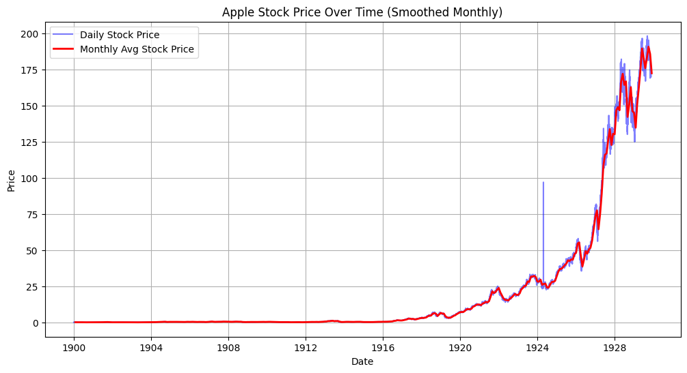

# Apple Stock Price Anlysis

## Abstract
Predicting Apple stock market trends using probabilistic models can assist investors in making informed decisions, mitigating financial risks, and optimizing investment strategies. This work proposes an AI agent utilizing the PEAS framework, evaluating performance through accuracy, precision, recall, and F1-score to ensure reliability. The agent operates in financial markets, using sensors (e.g., market indicators such as opening price, high, low, volume, and percentage change) to analyze historical stock data and actuators (e.g., buy, sell, or hold recommendations) to guide investment decisions. This work explores Bayesian networks (modeling relationships between stock indicators via probability distributions), Hidden Markov Models (capturing market state transitions such as bullish and bearish trends), and hybrid approaches integrating probabilistic reasoning with machine learning. The prediction tasks focus on classifying quarterly price changes into categories (e.g., increase or decrease) and further categorizing the magnitude of change as small or large. Challenges include handling market volatility, ensuring model robustness against sudden economic shifts, and addressing ethical concerns related to algorithmic trading and investor reliance on AI predictions. By balancing predictive accuracy with financial ethics, the agent could provide a data-driven approach to stock market trend classification.

## Agent Design: PEAS Framework
### PEAS Description
- Performance: The model's effectiveness is evaluated using accuracy, precision, recall, F1-score, and log loss.
- Environment: The agent functions in the financial market, where stock price movements are influenced by factors such as historical trends, market sentiment, and macroeconomic events.
- Actuators: The agent provides recommendations in the form of buy, sell, or hold signals based on its probabilistic predictions.
- Sensors: The agent ingests financial indicators such as opening price, high, low, volume, and percentage change to analyze historical data.

The world of our AI agent is the **financial market**, a dynamic and data-rich environment where stock prices fluctuate due to a wide range of factors. Although vast amounts of historical data are available for analysis, the market remains highly volatile and subject to real-world events—such as geopolitical tensions, economic shifts, and investor sentiment—which our agent cannot directly perceive or predict. Given this uncertainty, our agent is designed as a **goal-based agent**, aiming to classify quarterly price changes and their magnitude to assist investors in making informed decisions. Rather than directly making decisions for investors, our model identifies potential trends and provides probabilistic insights, allowing users to incorporate additional information and judgment into their investment strategies.

## Dataset Exploration and Preprocessing
### Preprocessing
Our dataset consists of stock price information, including 10849 observations of **open, high, low, closing prices, trading volume, and percentage changes**. Before training, we conducted an exploratory data analysis to understand the distribution of our variables. We identified several data preprocessing needs.

- The **Date** variable was converted into **datetime format** and sorted chronologically.
- String-based numerical values, such as **percentage change (Change %) and volume (Vol.)**, were converted into numeric format.
- **Missing values** were found in the **Vol. (Volume)** column. We replaced these missing values with the column mean to maintain consistency in the dataset.
- Corrupted data values were identified and corrected, ensuring all entries were valid.
- A final check using `df.isnull().sum()` confirmed that there were no missing values remaining in the dataset.
  
### Feature Engineering and Scaling
To enhance model performance, we extracted **time-based features** from the dataset and applied scaling. These transformations ensured that the model could learn patterns based on **time trends** rather than treating dates as arbitrary numerical values. In our first model, we extracted Year, Day, DayofWeek, and Quarter to fully capture the temporal features. However, for the second model, we would like to train a **Hidden Markov Model(HMM)**. Because of the nature of HMM already considers the temporal characteristic of the feeded data, we only extracted the cyclic features DayofWeek and Quarter this time in case HMM does not fully capture these. 

- **Extracted Features**:
  - **Day_of_week**: Numeric representation (1-7).
  - **Quarter**: Extracted quarter of the year (1-4).

To prepare the dataset for Hidden Markov Model modeling, numerical variables **Price, Open, High, Low, Vol., Change %** were categorized into different bins where necessary. To align the dataset with the traditional Hidden Markov Model’s requirement for univariate observations, we transformed multivariate features into composite observation codes. Each code represents a unique combination of original features. This encoding represents the unique states for the observation of the Hidden Markov Model. We generated two observation variants: one with temporal features to test the influence of cyclical trends on HMM, and one without to isolate their impact. By unifying features into symbolic states, we enable the HMM to model sequential dependencies while retaining contextual richness.

```python
features = ['Price', 'Open', 'High', 'Low', 'Vol.', 'Change %']
features_w_temporal = ['Price', 'Open', 'High', 'Low', 'Vol.', 'Change %', 'Day_of_week', 'Quarter']

df['observation'] = df[[f'{col}_bin' for col in features]].astype(str).agg('-'.join, axis=1)
df['observation_w_temporal'] = df[[f'{col}_bin' for col in features_w_temporal]].astype(str).agg('-'.join, axis=1)
encoder1= LabelEncoder()
encoder2 = LabelEncoder()
df['observation_code'] = encoder1.fit_transform(df['observation'])
df['observation_code_w_temporal'] = encoder2.fit_transform(df['observation_w_temporal'])
```

But we also learned another HMM using numeric features from ChatGPT by asking it how we should deal with numeric features besides transforming them into categorical ones using binning strategy, which is the Gaussian HMM. For this model, we used the original numeric data during training. Again, we generated two datasets, one with temporal features and another one without them.

```python
features_gaussian = ['Price', 'Open', 'High', 'Low', 'Vol.', 'Change %', 'Day_of_week', 'Quarter']
scaler = StandardScaler()
df_standardized = pd.DataFrame(scaler.fit_transform(df[features_gaussian]), columns=features_gaussian)

df_standardized['Trend_class'] = df['Trend_class'].values
df_standardized['Direction_quarter'] = df['Direction_quarter'].values
```

### Target Variables
Our model predicts **quarterly stock price movement**, focusing on two target variables:

- **Direction_quarter**: A binary classification task where 1 indicates a price increase and 0 indicates a decrease.
- **Trend_class**: A multi-class classification problem that categorizes the magnitude of price changes over a quarter (large decrease, moderate decrease, small decrease, small increase(including no change), moderate increase, and large increase).

To align with these targets, we introduced:
- **Price_future_quarter**: The closing price shifted 63 days ahead (approximately one quarter).
- **Quarterly_change_pct**: The percentage change in price over the next quarter.

### Column Descriptions

| Column Name          | Description |
|----------------------|-------------|
| **Date**             | The date of the stock price entry. |
| **Price**            | Closing price of the stock. |
| **Open**             | Opening price of the stock. |
| **High**             | Highest price during the day. |
| **Low**              | Lowest price during the day. |
| **Vol.**             | Trading volume, converted to numeric format. |
| **Change %**         | Percentage change in stock price, converted to numeric format. |
| **Day_of_week**      | Extracted day of the week (1-7). |
| **Quarter**          | Extracted quarter of the year (1-4). |
| **Price_future_quarter** | Shifted price 63 days ahead to predict quarterly change. |
| **Quarterly_change_pct** | Percentage change in price over the next quarter. |
| **Direction_quarter** | Indication of the trend of the stock price after a quarter. |
| **Trend_class**      | Trend magnitude (6 categories). |

Since we only used the encoded observations to train our traditional HMM and the original numeric features to train the Gaussian HMM, eventually the data was split into training and test sets with the following dimensions:

- **Traditional HMM**
  - **X_train shape**: (8679, 1)
  - **X_test shape**: (2170, 1)
  - **y_train shape**: (8679, 2)
  - **y_test shape**: (2170, 2)
- **Gaussian HMM**
  - **X_train shape**: (8679, 8)
  - **X_test shape**: (2170, 8)
  - **y_train shape**: (8679, 2)
  - **y_test shape**: (2170, 2)

### Data Exploration
Based on the graph of the distribution of each feature in comparison to the trend of the stock, we can see that the Price, Open, High, and Low features share very similar distribution to each of the trend categories.


From the heat map above, the correlations between **Price, Open, High, and Low** features share strongly connected to the year while other features have little to no relationship.


The following graph displays Apple’s stock price over time, with daily stock prices shown in blue and monthly average prices in red. The stock price remain a long period of minimal growth followed by a sharp increase in trend from around 1920 to later years. This suggests a significant rise in Apple’s valuation over time.



The following graph showcased the historical trading volume trends throughout the time range. It exhibits significant volatility, with sharp spikes indicating periods of heightened market activity especially around 1912 to 1916. The pattern suggests some major economic events influencing the trending behavior during those periods.


The following graph presents the distribution of daily returns, showing the frequency of different return values occurred. Most of the data are clustered around 0.0, which indicates that small daily changes were the most common.


This candlestick chart below represents the price movement of a financial asset over time, likely spanning multiple decades from 1980 onward. The green line represents the data of the closing price higher than the opening price, while the red one represents the other way around. The exponential rise in price in the later years, particularly after 2010, signifies significant growth and increased investor interest. The volume bars at the bottom indicate trading activities with occasional peaks suggesting periods of intense buying or selling activity. 


## Model Setup and Training
### Hidden Markov Model as a Temporal Extension of Bayesian Networks
We selected HMMs as our second model due to their inherent ability to model **temporal dependencies** in sequential data, which is a critical limitation of standard Bayesian Networks. While Bayesian Networks excel at static probabilistic relationships, HMMs extend this framework by introducing hidden states that evolve over time, emitting observations at each step. This aligns with stock market data, where trends are influenced by latent market regimes that persist across time steps. By capturing transitions between hidden states and their emission probabilities, HMMs provide a natural mechanism to infer **temporal patterns** in price movements. We implemented two variants of HMMs to evaluate different observation assumptions.

### HMM Configuration
The `hmmlearn(https://hmmlearn.readthedocs.io/en/latest/)` library was chosen for its robust support of Hidden Markov Models, offering specialized implementations for both **discrete observations** (Multinomial HMM) and **continuous observations** (Gaussian HMM). Its integration with the packages like NumPy and scikit-learn and built-in algorithms like Expectation Maximization and Viterbi decoding streamlined training and inference, enabling efficient financial time-series analysis.

#### Multinomial HMM (Categorical Observations)
Traditional HMMs assume discrete observations. To comply with this, we binned continuous features (e.g., Price, Vol.) into categorical states and encoded them into single observation symbols (e.g., Price=2, Vol.=1 → "2-1"). This approach mirrors how Bayesian Networks handle discrete nodes but focuses on sequences. Key parameters include:

- `n_components=6`: Matches the six hidden states (aligned with the Trend_class labels) to capture distinct market regimes.
- `n_iter=100`: Limits the Expectation-Maximization(EM) training algorithm to 100 iterations to balance convergence and computational cost.
- `algorithm="viterbi"`: Uses the Viterbi algorithm during inference to decode the most likely sequence of hidden states from observations.
- `params="ste"`: Directs the model to learn three parameters:
  - s: Initial state probabilities (startprob_).
  - t: State transition probabilities (transmat_).
  - e: Observation emission probabilities (emissionprob_).
- `init_params=""`: Disables automatic initialization, allowing manual control over emission probabilities.

```python
model = hmm.MultinomialHMM(  
    n_components=6,
    n_iter=100,
    algorithm="viterbi",
    params="ste", 
    init_params=""
)  
model.emissionprob_ = np.ones((n_states, n_observations)) / n_observations 
```

#### Gaussian HMM (Continuous Observations)
Feature binning in traditional HMMs can lead to **information loss**. For example, if stock prices are categorized into bins at 100 dollars, then a small difference (e.g., 99.9 vs. 100.1) places values in separate bins despite their similarity. This discretization can obscure fine-grained trends. To address this, we use Gaussian Hidden Markov Models (Gaussian HMMs), an extension of the HMM framework that models continuous observations using multivariate Gaussian distributions. This approach is well-suited for stock market data, where features like price and volume are inherently continuous and exhibit nuanced trends.

For a hidden state $z_t$, the emission probability of observation $\mathbf{x}_t$ (a vector of features) follows a multivariate normal distribution:  
$$P(\mathbf{x}_t | z_t) = \mathcal{N}(\mathbf{x}_t; \boldsymbol{\mu}_{z_t}, \boldsymbol{\Sigma}_{z_t})$$
where:  
- $\boldsymbol{\mu}_{z_t}$: Mean vector of state $z_t$.  
- $\boldsymbol{\Sigma}_{z_t}$: Covariance matrix of state $z_t$.

The Gaussian HMM is particularly suited for this analysis due to its ability to model continuous financial metrics like stock prices and trading volumes directly, preserving their granularity **without the need for discretization**. By introducing **multivariate** Gaussian distributions, the model captures correlations between features—such as how price fluctuations co-vary with trading volume during distinct market regimes—while offering flexibility through diagonal or full covariance structures to balance model complexity and real-world applicability. Key parameters include:

- `n_components=6`: Matches the six hidden states (aligned with the Trend_class labels) to capture distinct market regimes.
- `covariance_type="diag"`: Restricts covariance matrices to diagonal form, assuming feature independence within a state. This reduces computational complexity while retaining interpretability.
- `n_iter=100`: Limits the Expectation-Maximization(EM) training algorithm to 100 iterations to balance convergence and computational cost.
- `algorithm="viterbi"`: Uses the Viterbi algorithm during inference to decode the most likely sequence of hidden states from observations.

```python
model = hmm.GaussianHMM(
  n_components=6,
  covariance_type="diag",
  n_iter=100,
  random_state=42
)
```

Unlike the Multinomial HMM, the Gaussian HMM automates parameter initialization using the training data: means $\boldsymbol{\mu}$ are initialized via k-means clustering to align hidden states with natural clusters in the feature space, while covariances $\boldsymbol{\Sigma}$ are set to the overall variance of the training data, ensuring stable initial distributions that serve as a robust starting point for EM training.

### Model Training
Both HMMs use the **Expectation Maximization(EM) algorithm** to iteratively refine parameters, maximizing the likelihood of observed sequences. The **Viterbi algorithm** decodes hidden states for evaluation.

```python
# Multinomial HMM
MHMM.fit(X_train, lengths=[len(X_train)])
# Gaussian HMM
GHMM.fit(X_train)
```

### Model Evaluation
We defined our own evaluation function to calculate the metrics used to evaluate our model performance, including **accuracy, precision, recall, and f1-score**.

```python
def evaluate(y_true, y_pred, target_name):
    accuracy = accuracy_score(y_true, y_pred)
    precision = precision_score(y_true, y_pred, average="weighted", zero_division=0)
    recall = recall_score(y_true, y_pred, average="weighted", zero_division=0)
    f1 = f1_score(y_true, y_pred, average="weighted", zero_division=0)
    
    print(f"{target_name} Evaluation:")
    print(f"Accuracy: {accuracy:.2f}")
    print(f"Precision: {precision:.2f}")
    print(f"Recall: {recall:.2f}")
    print(f"F1 Score: {f1:.2f}")
    print()
```

We started by examining the performance of our first Multinomial Hidden Markov Model without considering the temporal features. Then we compared it with the same model trained by data including temporal features to make a comparison in order to see if the cyclic temporal features have any effect on the model performance. After that, we did the same thing to the Gaussian Hidden Markov Model. Eventually we have four model performances in total for comparison.

## Results Analysis
We evaluated both **Multinomial HMM (MHMM)** and **Gaussian HMM (GHMM)** on their ability to predict `Direction_quarter` (binary) and `Trend_class` (multi-class). Performance was unaffected by the inclusion of temporal features (`Day_of_week`, `Quarter`), suggesting these features lack discriminative power in our dataset.

| Model               | Metric         | Direction_quarter | Trend_class |
|:-------------------:|:--------------:|:-----------------:|:-----------:|
| **Multinomial HMM** | Accuracy       | 0.68              | 0.46        |
|                     | Precision      | 0.78              | 0.46        |
|                     | Recall         | 0.68              | 0.46        |
|                     | F1 Score       | 0.55              | 0.45        |
| **Gaussian HMM**    | Accuracy       | 0.68              | 0.61        |
|                     | Precision      | 0.46              | 0.57        |
|                     | Recall         | 0.68              | 0.61        |
|                     | F1 Score       | 0.55              | 0.46        |

### Quarter_direction Performance Analysis
#### Multinomial HMM
The Multinomial HMM achieved **68% accuracy** for predicting quarterly price direction (`Direction_quarter`), but this exhibited severe bias. The model *never* predicted class 0 ("decrease"), despite 702 test samples, and exclusively favored class 1 ("increase"), as shown in its classification report. 

| Labels | precision  | recall | f1-score | support|
|:------:|:----------:|:------:|:--------:|:------:|
| 0      | 1.00       | 0.00   | 0.00     | 702    |
| 1      | 0.68       | 1.00   | 0.81     | 1468   |

#### Gaussian HMM
The Gaussian HMM mirrored this behavior, also achieving 68% accuracy with **identical recall/f1-score metrics**. Like the MHMM, it defaulted to predicting "increase" for all samples, ignoring the "decrease" class entirely. Unlike the MHMM, the GHMM had 0% precision for class 0 ("decrease"), indicating it never correctly identified a true "decrease" and entirely avoided predicting this class.

| Labels | precision  | recall | f1-score | support|
|:------:|:----------:|:------:|:--------:|:------:|
| 0      | 0.00       | 0.00   | 0.00     | 702    |
| 1      | 0.68       | 1.00   | 0.81     | 1468   |

#### Model Comparison
| Aspect                 | Multinomial HMM                    | Gaussian HMM                           |
|:----------------------:|:----------------------------------:|----------------------------------------|
| **Accuracy**           | 68%                                | 68%                                    |
| **Minority Class (0)** | 0% metrics (1.00 precision*)       | 0% metrics (0.00 precision)            |
| **Majority Class (1)** | 68% precision, 100% recall         | 68% precision, 100% recall             |
| **Strengths**          | Handles categorical observations   | Captures continuous dynamics           |
| **Weaknesses**         | Misleading precision for class 0   | Avoids "decrease" predictions entirely |

*\*MHMM shows 1.00 precision for class 0 due to zero predictions, not true performance.*

### Trend_class Performance Analysis
#### Multinomial HMM
The Multinomial HMM achieved **46% accuracy** for `Trend_class` but failed to capture meaningful trends for minority classes. The model showed **0% precision/recall** for all rare categories (`large_decrease`, `large_increase`, `moderate_decrease`, `moderate_increase`), as seen in its classification report. Partial success was limited to majority classes (`small_decrease` and `small_increase`), with moderate recall for class 4 (51%) and higher precision for class 5 (61%).

| Labels                | precision | recall | f1-score | support |
|:---------------------:|:---------:|:------:|:--------:|:-------:|
| 0 (large_decrease)    | 0.00      | 0.00   | 0.00     | 4       |
| 1 (large_increase)    | 0.00      | 0.00   | 0.00     | 32      |
| 2 (moderate_decrease) | 0.00      | 0.00   | 0.00     | 39      |
| 3 (moderate_increase) | 0.00      | 0.00   | 0.00     | 119     |
| 4 (small_decrease)    | 0.31      | 0.51   | 0.38     | 659     |
| 5 (small_increase)    | 0.61      | 0.50   | 0.55     | 1317    |

#### Gaussian HMM
The Gaussian HMM improved accuracy to **61%** but overfit to the majority class (`small_increase`), achieving **100% recall** for class 5 while ignoring most minority trends. While it showed marginal improvement for `large_decrease` (33% precision), it entirely failed on `large_increase` (class 1), `moderate_decrease` (class 2) and `moderate_increase` (class 3).

| Labels                | precision | recall | f1-score | support |
|:---------------------:|:---------:|:------:|:--------:|:-------:|
| 0 (large_decrease)    | 0.33      | 0.25   | 0.29     | 4       |
| 1 (large_increase)    | 0.00      | 0.00   | 0.00     | 32      |
| 2 (moderate_decrease) | 0.00      | 0.00   | 0.00     | 39      |
| 3 (moderate_increase) | 0.00      | 0.00   | 0.00     | 119     |
| 4 (small_decrease)    | 0.67      | 0.00   | 0.01     | 659     |
| 5 (small_increase)    | 0.61      | 1.00   | 0.76     | 1317    |

#### Model Comparison
| Aspect                     | Multinomial HMM                    | Gaussian HMM                           |  
|:--------------------------:|:----------------------------------:|:----------------------------------------|
| **Accuracy**               | 46%                                | 61%                                     |  
| **Minority Classes (0-3)** | 0% metrics for all                 | 0-33% precision (class 0 only)          |
| **Majority Classes (4-5)** | Partial success (31-61% prec.)     | Overfitted to class 5 (100% recall)     |
| **Strengths**              | Handles categorical observations   | Captures continuous feature dynamics    |
| **Weaknesses**             | Loses granularity in binning       | Still dominated by class imbalance      |

Our HMMs showed modest improvements over the Bayesian Network (BN) baseline—achieving **68% accuracy** for `Direction_quarter` (vs. BN’s 53%) and **61% accuracy** for `Trend_class` (vs. BN’s 47%)—but these gains are superficial. Both HMMs exploited class imbalance, defaulting to majority classes (`increase` for direction, `small_increase` for trend) to inflate accuracy, while minority classes (e.g., `large_increase`, `moderate_decrease`) had **0% precision/recall**. This mirrors the BN’s failure to generalize beyond majority trends, highlighting a systemic issue: stock data’s inherent imbalance and volatility make minority trend prediction intractable without external signals. The HMMs’ marginally better performance stems from their ability to model temporal sequences, but they remain blind to external drivers and fail to resolve feature limitations.  

## Conclusion
Our second model (HMMs) outperformed the Bayesian Network superficially but failed to address core challenges in financial trend prediction, as improvements were driven by overfitting to majority classes rather than nuanced learning. To address this problem, **class imbalance mitigation** through resampling (e.g., SMOTE) or cost-sensitive learning could prioritize minority trends like "large_increase," while **enhanced feature engineering**—such as cyclically encoding `Day_of_week` or integrating external data (news sentiment, macroeconomic indicators)—might capture hidden drivers of market shifts. **Hybrid architectures** combining HMMs with LSTMs could model long-term dependencies. Alternatively, exploring **transformers** for attention-based sequence modeling could yield more robust insights. Together, these steps could transform superficial accuracy into actionable predictions for critical market movements.
